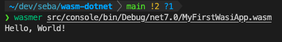

## WASM-DOTNET

Personal playground for wasm and .net

After seeing [this talk](https://www.youtube.com/watch?v=PIeYw7kJUIg) from [Steve Sanderson](https://twitter.com/stevensanderson) I thought I should give it a try and start playing around with WASM. 

The ultimate goal would be to replace one of my current public docker images, most likely [AzureStorageExplorer](https://github.com/sebagomez/azurestorageexplorer), with a WASM module published somewhere on a public "wasm registry" (if that's even a thing)

The first thing I want to do accomplish is just having a minimal Hello World console app.  

_*Note*: I used wasmer with the console app but it's not as mature as wasmtime, so I'm using wasmtime from now on._

Then I'd like to create a library as a wasm module, and reference that module (already compiled) from any WASM app. Ideally, I could also reference any WASMI compatible module, it could have been written in Rust, C/C++, Go, or whatever.  
Next step would be to create a web app, something that listens on port 80 and replies back.

We'll see where this takes me

_Follow the instructions on the [.NET WASI SDK](https://github.com/dotnet/dotnet-wasi-sdk) repo if you want to build it yourself. So far I have not changed anything_
