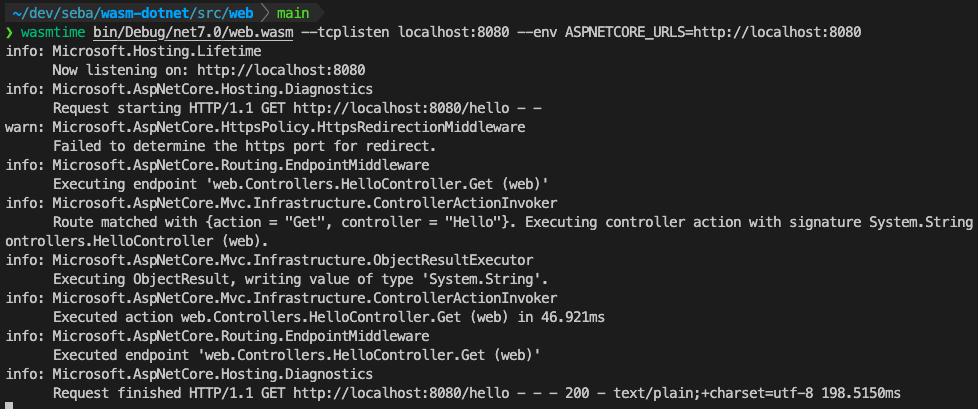
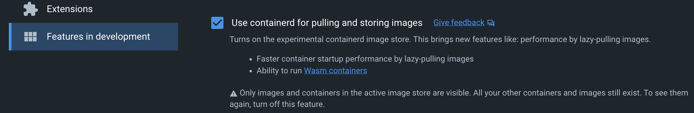

## WASM-DOTNET

Personal playground for wasm and .net

After seeing [this talk](https://www.youtube.com/watch?v=PIeYw7kJUIg) from [Steve Sanderson](https://twitter.com/stevensanderson) I thought I should give it a try and start playing around with WASM. 

We'll see where this takes me

_Follow the instructions on the [.NET WASI SDK](https://github.com/dotnet/dotnet-wasi-sdk) repo if you want to build it yourself. So far I have not changed anything_

The ultimate goal would be to replace one of my current public docker images, most likely [AzureStorageExplorer](https://github.com/sebagomez/azurestorageexplorer), with a WASM module published somewhere on a public "wasm registry" (if that's even a thing)

The first thing I want to do accomplish is just having a minimal Hello World console app.  


> I used wasmer with the console app but it's not as mature as wasmtime, so I'm using wasmtime from now on._



Then I'd like to create a library as a wasm module, and reference that module (already compiled) from any WASM app. Ideally, I could also reference any WASMI compatible module, it could have been written in Rust, C/C++, Go, or whatever.  

> So I wrote it in C# and I was glad to know I do NOT need to compile it for WASM myself. Which means every NuGet package out there can still be referenced and used in a WASM application. Which makes sense if you think about it, you don't want to recompile every simple existing package into WASM. You just use what you need and compile your application to WASM.

Next step would be to create a web app, something that listens on port 80 and replies back.

> The [web](./src/web/) app does that, and it also uses the [lib](./src/lib) previously created. I also created an account at [WebAssemblyHub](https://webassemblyhub.io/user/sebagomez) to have a registry for my wasm "images". And after downloading [wasme](https://docs.solo.io/web-assembly-hub/latest/installation/) I used the following commands to build and publish my image.

```bash
❯ wasme build precompiled src/web/bin/Debug/net7.0/web.wasm -t webassemblyhub.io/sebagomez/webapi-hello -c src/runtime-config.json
INFO[0000] adding image to cache...                      filter file=src/web/bin/Debug/net7.0/web.wasm tag=webassemblyhub.io/sebagomez/webapi-hello
INFO[0000] tagged image                                  digest="sha256:e2113b8571cde8ff004760131e5881476427f9079069401dfc6b0c7c694afcfc" image="webassemblyhub.io/sebagomez/webapi-hello:latest"
```

I used a `runtime-config.json` file that I "found" online  
```json
{
	"type": "envoy_proxy",
	"abiVersions": ["v0-541b2c1155fffb15ccde92b8324f3e38f7339ba6"],
	"config": {
	  "rootIds": [
		"add_header_root_id"
	  ]
	}
  }
```

```bash
❯ wasme push webassemblyhub.io/sebagomez/webapi-hello
INFO[0000] Pushing image webassemblyhub.io/sebagomez/webapi-hello 
INFO[0023] Pushed webassemblyhub.io/sebagomez/webapi-hello:latest 
INFO[0023] Digest: sha256:c2c6bb62ab74d97a67bc37786397e891319d889f61dce724c721a1e3adbb3611 
```

So now, there's supposed to be a wasm module at webassemblyhub.io/sebagomez/webapi-hello

Let's see how can I now create a K8s cluster with a wasi runtime where I can execute a pod with that image.

### Using Docker Desktop 

I also tried using Docker Desktop to achieve the same thing. 

First, I had to enable `containerd`.



Following [Docker decumentation](https://docs.docker.com/desktop/wasm/), I executed the following command

```bash
docker run -dp 8080:8080 \
  --name=wasm-example \
  --runtime=io.containerd.wasmedge.v1 \
  --platform=wasi/wasm32 \
  michaelirwin244/wasm-example
```

and it worked!, so now I wanted to run my own previously created and hosted in webassemblyhub

```bash
docker run -dp 8080:80 \
  --name=wasm-example \
  --runtime=io.containerd.wasmedge.v1 \
  --platform=wasi/wasm32 \
  webassemblyhub.io/sebagomez/webapi-hello
```

But I got the following error
```
Unable to find image 'webassemblyhub.io/sebagomez/webapi-hello:latest' locally
c2c6bb62ab74: Exists 
e2113b8571cd: Exists 
8a9e8005fb72: Exists 
docker: failed to unpack image on snapshotter stargz: mismatched image rootfs and manifest layers.
See 'docker run --help'.
```

Which I was kinda expecting because the wasm module was "compiled" for wasme and Docker Desktop uses [wasmedge](https://wasmedge.org/), so, what I need to do is to create a wasm module for wasmedge. 

I finally created two Dockerfiles, one to build the app, and another one to build the wasm docker image.

```bash
docker build -o ./bin .
```

This command will build the app and copy the output to a ./bin folder.

```bash
docker buildx build --platform wasi/wasm32 -t sebagomez/webapi-hello -f wasm.Dockerfile . 
```

And this command will get the output from the previous one and build the wasm Docker image. 

So right now I have two images with the same application, webapi-dll is the ASP.NET Core app running on a standard Docker image and webapi-hello is the wasm version odf the same app.  
The first difference you can see right away is their size  

```bash
❯ docker images
REPOSITORY               TAG       IMAGE ID       CREATED         SIZE
sebagomez/webapi-dll     latest    41a26455f214   6 seconds ago   97MB
sebagomez/webapi-hello   latest    479b4589c215   5 minutes ago   16.8MB
```

Now let's use them!

```bash
❯ docker run -P --name=wasm-example --runtime=io.containerd.wasmedge.v1 --platform=wasi/wasm32 sebagomez/webapi-hello 
[2022-12-30 16:45:23.113] [error] instantiation failed: incompatible import type, Code: 0x61
[2022-12-30 16:45:23.114] [error]     Mismatched function type. Expected: FuncType {params{i32 , i32 , i32} returns{i32}} , Got: FuncType {params{i32 , i32} returns{i32}}
[2022-12-30 16:45:23.114] [error]     When linking module: "wasi_snapshot_preview1" , function name: "sock_accept"
[2022-12-30 16:45:23.114] [error]     At AST node: import description
[2022-12-30 16:45:23.114] [error]     At AST node: import section
[2022-12-30 16:45:23.114] [error]     At AST node: module
docker: Error response from daemon: Others("incompatible import type"): unknown.
ERRO[0001] error waiting for container: context canceled 
```

###

Followed steps from here: https://docs.krustlet.dev/howto/krustlet-on-minikube/
CONFIG_DIR=$CONFIG_DIR FILE_NAME=$FILE_NAME bash <(curl https://raw.githubusercontent.com/krustlet/krustlet/main/scripts/bootstrap.sh)

KUBECONFIG=~/.krustlet/config/kubeconfig \
  krustlet-wasi \
  --node-ip 192.168.64.1 \
  --node-name=krustlet \
  --bootstrap-file=${HOME}/.krustlet/config/bootstrap.conf

  Got stuck here and posted this issue: [Error setting up krustlet on Minikube [MacOS]](https://github.com/krustlet/krustlet/issues/734)

  Will try to setup an EKS cluster following this [doc](https://learn.microsoft.com/en-us/azure/aks/use-wasi-node-pools). 
  That article uses wasmtime, and we used docker for wasmedge, so I'm not sure it'll work. I haven't tried my compiled wasm apps with wasmedge, so I'll give that a try 

  ```bash
❯ wasmedge /Users/seba/dev/seba/wasm-dotnet/src/console/bin/Debug/net7.0/MyFirstWasiApp.wasm
Hello Console World!
```

```bash
❯ wasmedge /Users/seba/dev/seba/wasm-dotnet/src/web/bin/Debug/net7.0/web.wasm
[2022-12-30 11:20:15.695] [error] instantiation failed: incompatible import type, Code: 0x61
[2022-12-30 11:20:15.695] [error]     Mismatched function type. Expected: FuncType {params{i32 , i32 , i32} returns{i32}} , Got: FuncType {params{i32 , i32} returns{i32}}
[2022-12-30 11:20:15.695] [error]     When linking module: "wasi_snapshot_preview1" , function name: "sock_accept"
[2022-12-30 11:20:15.695] [error]     At AST node: import description
[2022-12-30 11:20:15.695] [error]     At AST node: import section
[2022-12-30 11:20:15.695] [error]     At AST node: module
```

Same problem with the socket... back to sqaure one.

FYI: this is what I got with wasmer  
```bash 
❯ wasmer /Users/seba/dev/seba/wasm-dotnet/src/web/bin/Debug/net7.0/web.wasm
error: failed to run `/Users/seba/dev/seba/wasm-dotnet/src/web/bin/Debug/net7.0/web.wasm`
│   1: failed to instantiate WASI module
╰─▶ 2: Error while importing "wasi_snapshot_preview1"."sock_accept": unknown import. Expected Function(FunctionType { params: [I32, I32, I32], results: [I32] })
```

While with wasmtime worked as a charm (with some options)
```bash
❯ wasmtime /Users/seba/dev/seba/wasm-dotnet/src/web/bin/Debug/net7.0/web.wasm --tcplisten localhost:8080 --env ASPNETCORE_URLS=http://localhost:8080
info: Microsoft.Hosting.Lifetime
      Now listening on: http://localhost:8080
info: Microsoft.AspNetCore.Hosting.Diagnostics
      Request starting HTTP/1.1 GET http://localhost:8080/ - -
warn: Microsoft.AspNetCore.HttpsPolicy.HttpsRedirectionMiddleware
      Failed to determine the https port for redirect.
```

So, I need a cluster with a wasm node with the wasmtime runtime. Which means that (I think) the image I wrote with Docker Desktop will not work, but which also brings me to the first image I 

az aks nodepool add \
    --resource-group eks-wasm \       
    --cluster-name wasm-test \   
    --name mywasipool \
    --node-count 1 \
    --workload-runtime WasmWasi

This failed and I had to create an issue :( [Error adding wasm nodes](https://github.com/Azure/azure-cli/issues/25011)

I found another way of doing it using the GitHub registry to host the packages, but I need to use wasm-to-oci to create an OCI compatible image.
After installing wasm-to-oci I used the follwoing command to push my "image" to the GitHub registry.

```bash
❯ wasm-to-oci push bin/web.wasm ghcr.io/sebagomez/wasm-dotnet:latest
INFO[0002] Pushed: ghcr.io/sebagomez/wasm-dotnet:latest 
INFO[0002] Size: 40698604                               
INFO[0002] Digest: sha256:faeaab610046be8ec3d8f612677b8688faf036a45719f6c28d0f39d7368311cc 
```

After pushing to the registry I don't get any errors, but I don't see the image anywhere in GitHub and I can't pull it. Will try to push it from a GitHub action